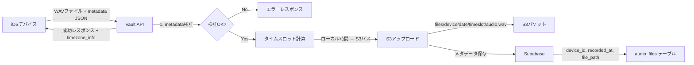

# WatchMe Vault API (S3 Storage)

**iOSデバイスからの録音データをS3に保存するシンプルなアップロードAPI**

WatchMeプロジェクトにおけるファイル管理のエントリーポイントとなるAPIです。iOSデバイスから送信されたWAVファイルをAmazon S3に保存し、後続の処理API（transcriber, behavior, emotion）が処理できるようにSupabaseにメタデータを登録します。

---

## 🎯 夜間スキップ機能（SKIP設定）

**概要:**

特定のデバイスの夜間録音データを自動的にスキップする機能です。これにより、不要な夜間データの処理を省き、コストを最適化できます。

**現在の実装（2025年11月更新）:**

スキップ設定はapp.py内の定数として管理されています：

```python
# app.py内の設定
SKIP_ENABLED = True  # スキップ機能の有効/無効
SKIP_DEVICE_IDS = ['9f7d6e27-98c3-4c19-bdfb-f7fda58b9a93']  # 対象デバイス
SKIP_HOURS = [23, 0, 1, 2, 3, 4, 5]  # スキップ時間帯（23時〜5時台）
```

**設定を変更する場合:**

1. `app.py`を直接編集
2. GitHubにプッシュ
3. CI/CDによる自動デプロイ

**動作仕様:**
- スキップ対象の時間帯のデータは`transcriptions_status = 'skipped'`として記録
- Lambda関数はskippedステータスを検出して累積分析を継続
- 処理コストを削減しながら、ダッシュボードの継続性を維持

---

## 🗺️ ルーティング詳細

| 項目 | 値 | 説明 |
|------|-----|------|
| **🏷️ サービス名** | Vault API | 音声ファイルストレージ |
| **📦 機能** | File Upload & Metadata | S3アップロード・メタデータ管理 |
| | | |
| **🌐 外部アクセス（Nginx）** | | |
| └ 公開エンドポイント | `https://api.hey-watch.me/vault/` | Nginx経由の公開URL |
| └ Nginx設定ファイル | `/etc/nginx/sites-available/api.hey-watch.me` | |
| └ proxy_pass先 | `http://localhost:8000/` | 内部転送先 |
| └ タイムアウト | 180秒 | read/connect/send |
| | | |
| **🔌 API内部エンドポイント** | | |
| └ ヘルスチェック | `/health` | GET - 死活監視 |
| └ ステータス | `/status` | GET - /healthのエイリアス |
| └ **音声ファイルアップロード** | `/upload` | POST - iOSデバイスから呼ばれる |
| └ **音声ファイル一覧** | `/api/audio-files` | GET - API Manager用 |
| └ **署名付きURL生成** | `/api/audio-files/presigned-url` | GET - ブラウザ再生用 |
| └ **デバイス一覧** | `/api/devices` | GET - API Manager用 |
| | | |
| **🐳 Docker/コンテナ** | | |
| └ コンテナ名 | `watchme-vault-api` | |
| └ ポート（内部） | 8000 | コンテナ内 |
| └ ポート（公開） | `127.0.0.1:8000:8000` | ローカルホストのみ |
| └ ヘルスチェック | `/health` | Docker healthcheck |
| | | |
| **☁️ AWS ECR** | | |
| └ リポジトリ名 | `watchme-api-vault` | |
| └ リージョン | ap-southeast-2 (Sydney) | |
| └ URI | `754724220380.dkr.ecr.ap-southeast-2.amazonaws.com/watchme-api-vault:latest` | |
| | | |
| **📂 ディレクトリ** | | |
| └ ソースコード | `/Users/kaya.matsumoto/projects/watchme/api/vault/watchme_api` | ローカル |
| └ GitHubリポジトリ | `hey-watchme/api-vault` | ⚠️ ECRとは異なる名前 |
| └ EC2配置場所 | `/home/ubuntu/watchme-vault-api-docker` | |
| | | |
| **🔗 呼び出し元** | | |
| └ iOSアプリ | WatchMe iOS App | 手動録音・自動録音 |
| └ Observerデバイス | ESP32/M5 CORE2 | 30分ごと自動録音 |
| └ 呼び出しURL | `https://api.hey-watch.me/vault/upload` | |
| | | |
| **⚡ 後続処理** | | |
| └ S3イベント通知 | → Lambda: audio-processor | S3へのPUT時に起動 |
| └ SQSキュー | → Lambda: audio-worker | 音声処理パイプライン開始 |

---

## 🎯 主な責務

このAPIは以下の2つの機能に特化しています：

1. **WAVファイルのS3アップロード** - iOSデバイスから送信された音声ファイルをS3に保存
2. **メタデータのSupabase登録** - 後続APIが処理対象を発見できるようにメタデータを登録

## 📋 API仕様

### エンドポイント一覧

| メソッド | パス | 説明 |
|---------|------|------|
| POST | `/upload` | WAVファイルをS3にアップロード |
| GET | `/health` | APIの死活監視 |
| GET | `/status` | APIの死活監視（/healthのエイリアス） |
| GET | `/api/audio-files` | 音声ファイル一覧を取得（API Manager用） |
| GET | `/api/audio-files/presigned-url` | 音声ファイルの署名付きURLを生成 |
| GET | `/api/devices` | 登録されているデバイス一覧を取得 |
| GET | `/` | API情報ページ（HTML） |

### POST /upload

WAVファイルをS3にアップロードし、Supabaseにメタデータを登録します。

**リクエスト:**
- **Headers:**
  - `Content-Type`: `multipart/form-data`
- **Form Data:**
  - `metadata`: JSON形式のメタデータ（必須）
    - `device_id`: デバイスID（必須）
    - `recorded_at`: 録音時刻（必須、ISO 8601形式、タイムゾーン情報を含む）
  - `file`: WAVファイル（必須、最大100MB）

**重要: タイムゾーンの扱い**
- `recorded_at`に含まれるタイムゾーン情報はそのまま保持されます
- UTCへの変換は行いません
- ユーザーの現地時間での記録を正確に保存します

**設計思想: ユーザー中心のタイムスロット管理**
本APIは世界標準（ISO 8601形式）に準拠しながら、ユーザーの生活時間を最重要視する設計を採用しています：

1. **ユーザーの見ている時間を基準**: どこにいても、ユーザーが実際に体験した時間でデータを管理
2. **タイムスロットの生成**: S3パス（例：`13-30`）は、ユーザーのローカル時間の時刻から生成
3. **グラフ表示への配慮**: 後続のダッシュボードでは、ユーザーの時間軸でグラフを描画
4. **世界対応**: 日本からアメリカに移動しても、各地での生活時間が正確に記録される

この設計により、ユーザーは常に「自分が13:30に録音したファイル」として直感的にデータを理解できます。

**metadata JSONの例:**
```json
{
  "device_id": "device123",
  "recorded_at": "2025-07-19T13:30:00.123+09:00"
}
```

**レスポンス例（成功時）:**
```json
{
  "status": "ok",
  "s3_key": "files/device123/2025-07-19/13-30/audio.wav",
  "device_id": "device123",
  "recorded_at": "2025-07-19T13:30:00.123+09:00",
  "file_size_bytes": 2458624,
  "method": "s3_upload",
  "timezone_info": "+0900"
}
```

**エラーレスポンス例:**
```json
// metadata JSONが不正な場合
{
  "detail": "Invalid metadata JSON format"
}

// device_idが不足している場合
{
  "detail": "device_id is required in metadata"
}

// recorded_atが不足している場合
{
  "detail": "recorded_at is required in metadata"
}

// recorded_atの形式が不正な場合
{
  "detail": "Invalid recorded_at format. Expected ISO 8601: Unable to parse date string"
}

// ファイルサイズ超過
{
  "detail": "File size exceeds limit (100MB)"
}

// S3アップロード失敗
{
  "detail": "S3 upload failed: [エラー詳細]"
}
```

### GET /health, /status

APIの死活監視とS3/Supabase接続状態を確認します。

**レスポンス例:**
```json
{
  "status": "healthy",
  "timestamp": "2025-07-16T10:30:00+00:00",
  "s3_configured": true,
  "supabase_configured": true
}
```

### GET /api/audio-files

音声ファイル一覧を取得します（API Manager用）。

**用途**: API Manager画面で音声ファイル一覧を表示し、処理ステータスやファイル情報を確認する

**クエリパラメータ:**
- `device_id` (optional): 特定デバイスのファイルのみ取得
- `date_from` (optional): 開始日（YYYY-MM-DD形式）
- `date_to` (optional): 終了日（YYYY-MM-DD形式）
- `limit` (optional): 取得件数上限（デフォルト：100）
- `offset` (optional): オフセット（ページネーション用）

**レスポンス例:**
```json
{
  "files": [
    {
      "device_id": "9f7d6e27-98c3-4c19-bdfb-f7fda58b9a93",
      "recorded_at": "2025-08-25T02:01:01.408+00:00",
      "file_path": "files/9f7d6e27-98c3-4c19-bdfb-f7fda58b9a93/2025-08-25/11-00/audio.wav",
      "local_date": "2025-08-25",
      "time_block": "11-00",
      "transcriptions_status": "completed",
      "behavior_features_status": "completed",
      "emotion_features_status": "completed",
      "file_exists": true,
      "file_size_bytes": 1920044,
      "last_modified": "2025-08-25T02:01:55+00:00",
      "created_at": "2025-08-25T02:01:54.911469+00:00"
    }
  ],
  "total_count": 1,
  "limit": 100,
  "offset": 0
}
```

### GET /api/audio-files/presigned-url

音声ファイルの署名付きURLを生成します（ブラウザ再生・ダウンロード用）。

**用途**: API Manager画面で音声ファイルをブラウザ上で直接再生・ダウンロードする

**クエリパラメータ:**
- `file_path` (required): S3ファイルパス（例：`files/device123/2025-08-25/11-00/audio.wav`）
- `expiration_hours` (optional): URL有効期限（時間、デフォルト：1、最大：24）

**レスポンス例:**
```json
{
  "presigned_url": "https://watchme-vault.s3.ap-southeast-2.amazonaws.com/files/device123/2025-08-25/11-00/audio.wav?AWSAccessKeyId=AKIA...&Signature=...&Expires=1756094854",
  "file_path": "files/device123/2025-08-25/11-00/audio.wav",
  "expires_in_hours": 1,
  "expires_at": "2025-08-25T04:07:34.387860+00:00",
  "bucket": "watchme-vault"
}
```

**エラーレスポンス例:**
```json
// ファイルが存在しない場合
{
  "detail": "Audio file not found: files/device123/2025-08-25/11-00/audio.wav"
}
```

### GET /api/devices

登録されているデバイス一覧を取得します。

**用途**: API Manager画面でデバイス選択フィルターを表示する

**レスポンス例:**
```json
{
  "devices": [
    {
      "device_id": "9f7d6e27-98c3-4c19-bdfb-f7fda58b9a93"
    },
    {
      "device_id": "d067d407-cf73-4174-a9c1-d91fb60d64d0"
    }
  ],
  "total_count": 2
}
```

## 🗄️ データ構造

### S3パス構造

#### パス生成の仕組み
S3パスは、metadata JSON内の`recorded_at`フィールドから自動生成されます：

```
metadata.recorded_at: "2025-07-19T13:30:00.123+09:00"
     ↓ タイムゾーン変換なし（ユーザーのローカル時間を使用）
     ↓ 日付: 2025-07-19, 時刻: 13:30 → スロット: 13-30
     ↓
S3保存パス: files/device123/2025-07-19/13-30/audio.wav
```

#### タイムスロットの計算ルール
ユーザーのローカル時間の時・分から30分スロットを計算：
- `13:15` → `13-00` (13:00-13:29の枠)
- `13:30` → `13-30` (13:30-13:59の枠)  
- `13:45` → `13-30` (13:30-13:59の枠)

#### S3保存パス形式
```
files/{device_id}/{YYYY-MM-DD}/{HH-MM}/audio.wav
```
例: `files/device123/2025-07-19/13-30/audio.wav`

**重要**: パス内の時刻（例：`13-30`）は、ユーザーがその時刻に録音したローカル時間を表します。

### S3ファイルへのアクセス方法

#### S3のURL形式
S3に保存されたファイルのURLは以下の形式になります：
```
https://[バケット名].s3.[リージョン].amazonaws.com/[キー]
```

実際の例：
```
https://watchme-vault.s3.us-east-1.amazonaws.com/files/test_device_001/2025-07-18/14-30/audio.wav
```

#### ⚠️ 重要：ブラウザからの直接アクセスについて

**デフォルトではS3バケットは非公開設定のため、上記URLに直接アクセスしても403 Forbiddenエラーになります。**

音声ファイルにアクセスする方法は3つあります：

### 1. 署名付きURL（Presigned URL）- 推奨方法

一時的にアクセス可能なURLを生成する方法です。セキュリティを保ちながら、ブラウザから直接アクセスできます。

**実装例（Python/boto3）:**
```python
def generate_presigned_url(s3_key, expiration_hours=1):
    """
    S3オブジェクトの署名付きURLを生成
    
    Args:
        s3_key: S3のキー（例: files/device123/2025-07-18/14-30/audio.wav）
        expiration_hours: URLの有効期限（時間）
    
    Returns:
        署名付きURL（ブラウザで直接アクセス可能）
    """
    url = s3_client.generate_presigned_url(
        'get_object',
        Params={
            'Bucket': S3_BUCKET_NAME,
            'Key': s3_key
        },
        ExpiresIn=expiration_hours * 3600  # 秒単位
    )
    return url
```

**生成されるURL例:**
```
https://watchme-vault.s3.amazonaws.com/files/test_device_001/2025-07-18/14-30/audio.wav?AWSAccessKeyId=AKIA...&Signature=jMtT...&Expires=1752804858
```

このURLは指定時間（例：1時間）だけ有効で、ブラウザに貼り付けると音声ファイルを再生・ダウンロードできます。

### 2. AWS SDKを使用した直接取得

バックエンドから直接ファイルを取得する方法：

```python
# ファイルをメモリに読み込む
response = s3_client.get_object(Bucket=S3_BUCKET_NAME, Key=s3_key)
audio_data = response['Body'].read()

# ファイルをローカルに保存
s3_client.download_file(S3_BUCKET_NAME, s3_key, 'local_audio.wav')
```

### 3. S3バケットポリシーで公開（非推奨）

特定のパスのみ公開することも可能ですが、セキュリティリスクがあるため推奨しません。

### 管理画面での実装推奨パターン

管理画面から音声ファイルにアクセスする場合の推奨実装：

```python
# FastAPIエンドポイントの例
@app.get("/api/audio/presigned-url")
async def get_audio_presigned_url(
    device_id: str = Query(...),
    date: str = Query(...),
    time_slot: str = Query(...),
    expiration_hours: int = Query(default=1, le=24)
):
    """
    音声ファイルの署名付きURLを生成
    
    Returns:
        {
            "presigned_url": "https://...",
            "expires_in": "1時間",
            "s3_key": "files/device123/2025-07-18/14-30/audio.wav"
        }
    """
    s3_key = f"files/{device_id}/{date}/{time_slot}/audio.wav"
    
    # ファイルの存在確認
    try:
        s3_client.head_object(Bucket=S3_BUCKET_NAME, Key=s3_key)
    except ClientError:
        raise HTTPException(status_code=404, detail="Audio file not found")
    
    # 署名付きURL生成
    url = s3_client.generate_presigned_url(
        'get_object',
        Params={'Bucket': S3_BUCKET_NAME, 'Key': s3_key},
        ExpiresIn=expiration_hours * 3600
    )
    
    return {
        "presigned_url": url,
        "expires_in": f"{expiration_hours}時間",
        "s3_key": s3_key
    }
```

**フロントエンドでの使用例（React）:**
```javascript
// 署名付きURLを取得
const response = await fetch(`/api/audio/presigned-url?device_id=${deviceId}&date=${date}&time_slot=${timeSlot}`);
const data = await response.json();

// HTML5 Audioで再生
const audio = new Audio(data.presigned_url);
audio.play();

// またはaudioタグで表示
<audio controls src={data.presigned_url} />
```

### Supabaseテーブル構造（audio_files）

**現在の実装で使用しているカラム:**
| カラム名 | 型 | 説明 | 制約 |
|---------|-----|------|------|
| device_id | TEXT | デバイスID | NOT NULL, PRIMARY KEY の一部 |
| recorded_at | TIMESTAMPTZ | 録音開始時刻（ユーザーのローカル時間） | NOT NULL, PRIMARY KEY の一部 |
| file_path | TEXT | S3のファイルパス | NOT NULL |
| local_date | DATE | ローカル日付（YYYY-MM-DD形式） | NULL |
| time_block | VARCHAR(5) | タイムブロック（HH-MM形式、30分単位） | NULL |
| transcriptions_status | TEXT | 文字起こし処理状態 | NOT NULL DEFAULT 'pending' |
| behavior_features_status | TEXT | 行動分析処理状態 | NOT NULL DEFAULT 'pending' |
| emotion_features_status | TEXT | 感情分析処理状態 | NOT NULL DEFAULT 'pending' |
| created_at | TIMESTAMPTZ | レコード作成日時 | DEFAULT now() |

**インデックス:**
- PRIMARY KEY: `(device_id, recorded_at)`
- `idx_audio_files_device_date`: `(device_id, local_date)` - デバイスと日付での検索高速化
- `idx_audio_files_device_date_block`: `(device_id, local_date, time_block)` - デバイス、日付、時間帯での検索高速化

**注意事項:**
- 同じデバイスで同じ時刻のデータは重複不可（PRIMARY KEY制約）
- `local_date`と`time_block`は`file_path`から構造化された情報として保存
- `recorded_at`は将来的に削除予定ですが、現在はPRIMARY KEYの一部として必須

## 🚀 セットアップ

### 必要な環境変数

`.env`ファイルを作成し、以下の環境変数を設定してください：

```bash
# AWS S3設定
AWS_ACCESS_KEY_ID=your_access_key_id
AWS_SECRET_ACCESS_KEY=your_secret_access_key
S3_BUCKET_NAME=watchme-vault
AWS_REGION=us-east-1

# Supabase設定
SUPABASE_URL=https://your-project.supabase.co
SUPABASE_KEY=your_anon_key
```

### S3バケットの設定

1. AWSコンソールでS3バケットを作成（例: `watchme-vault`）
2. IAMユーザーを作成し、以下のポリシーを付与：

```json
{
  "Version": "2012-10-17",
  "Statement": [
    {
      "Effect": "Allow",
      "Action": [
        "s3:PutObject",
        "s3:GetObject",
        "s3:DeleteObject",
        "s3:ListBucket"
      ],
      "Resource": [
        "arn:aws:s3:::watchme-vault/*",
        "arn:aws:s3:::watchme-vault"
      ]
    }
  ]
}
```

### Supabaseの設定

1. Supabaseプロジェクトでテーブルを作成：

```sql
CREATE TABLE public.audio_files (
  device_id TEXT NOT NULL,
  recorded_at TIMESTAMPTZ NOT NULL,
  file_path TEXT NOT NULL,
  transcriptions_status TEXT NOT NULL DEFAULT 'pending'::text,
  behavior_features_status TEXT NOT NULL DEFAULT 'pending'::text,
  emotion_features_status TEXT NOT NULL DEFAULT 'pending'::text,
  created_at TIMESTAMPTZ NULL DEFAULT now(),
  local_date DATE NULL,
  time_block VARCHAR(5) NULL,
  CONSTRAINT audio_files_pkey PRIMARY KEY (device_id, recorded_at)
) TABLESPACE pg_default;

-- インデックスの作成（パフォーマンス向上）
CREATE INDEX IF NOT EXISTS idx_audio_files_device_date 
  ON public.audio_files USING btree (device_id, local_date) 
  TABLESPACE pg_default;

CREATE INDEX IF NOT EXISTS idx_audio_files_device_date_block 
  ON public.audio_files USING btree (device_id, local_date, time_block) 
  TABLESPACE pg_default;
```

### インストールと起動

#### 開発環境（ローカル）

```bash
# 依存関係のインストール
pip install -r requirements.txt

# 開発サーバーの起動
uvicorn app:app --reload --host 0.0.0.0 --port 8000
```

#### 本番環境（Docker + CI/CD - 推奨）

**本番環境ではGitHub Actionsによる自動CI/CDデプロイを使用します。**

### 🚀 CI/CDによる自動デプロイ（2025-10-31導入）

**デプロイ方法:**
```bash
# ローカルでコードを修正してpushするだけで自動デプロイ
git add .
git commit -m "feat: Update Vault API"
git push origin main

# GitHub Actionsが自動的に:
# 1. Dockerイメージをビルド
# 2. ECRにプッシュ
# 3. EC2にデプロイ
# 4. ヘルスチェック実行
```

**GitHub Actionsの確認:**
```
https://github.com/hey-watchme/vault/actions
```

**詳細なセットアップ手順:**
- [DEPLOY_INSTRUCTIONS.md](./DEPLOY_INSTRUCTIONS.md) - ユーザー向け実施手順
- [CICD_SETUP.md](./CICD_SETUP.md) - 詳細なセットアップ手順

### 📦 初回セットアップ（1回のみ）

初回のみ、以下の手動セットアップが必要です：

```bash
# 1. EC2にSSH接続
ssh -i ~/watchme-key.pem ubuntu@3.24.16.82

# 2. ディレクトリ作成（べき等性保証）
mkdir -p /home/ubuntu/watchme-vault-api

# 3. Dockerネットワーク作成
docker network create watchme-network 2>/dev/null || true

# 4. ログアウト
exit
```

**GitHub Secretsの設定:**
以下のSecretsをGitHubリポジトリに設定してください：
- `AWS_ACCESS_KEY_ID`
- `AWS_SECRET_ACCESS_KEY`
- `EC2_HOST`
- `EC2_SSH_PRIVATE_KEY`
- `EC2_USER`
- `SUPABASE_URL`
- `SUPABASE_KEY`
- `S3_BUCKET_NAME`

### 🔧 運用コマンド

```bash
# EC2にSSH接続
ssh -i ~/watchme-key.pem ubuntu@3.24.16.82

# コンテナログ確認
docker logs watchme-vault-api --tail 100

# コンテナステータス確認
docker ps | grep watchme-vault-api

# ヘルスチェック
curl http://localhost:8000/health

# 手動再起動（緊急時のみ）
cd /home/ubuntu/watchme-vault-api
./run-prod.sh
```

## 📱 iOSアプリからの使用例

```swift
// Swift実装例
func uploadAudioFile(deviceId: String, recordedAt: Date, audioData: Data) {
    let url = URL(string: "https://api.hey-watch.me/upload")!
    var request = URLRequest(url: url)
    request.httpMethod = "POST"
    
    // ISO8601フォーマッター（タイムゾーン情報を含む）
    let isoFormatter = ISO8601DateFormatter()
    isoFormatter.formatOptions = [.withInternetDateTime, .withTimeZone, .withFractionalSeconds]
    isoFormatter.timeZone = TimeZone.current  // ユーザーのローカルタイムゾーン
    let recordedAtString = isoFormatter.string(from: recordedAt)
    
    // metadata JSON の作成
    let metadata: [String: Any] = [
        "device_id": deviceId,
        "recorded_at": recordedAtString
    ]
    
    let boundary = UUID().uuidString
    request.setValue("multipart/form-data; boundary=\(boundary)", forHTTPHeaderField: "Content-Type")
    
    // Multipart Form Dataの構築
    var body = Data()
    
    // metadata フィールド
    if let jsonData = try? JSONSerialization.data(withJSONObject: metadata, options: []),
       let jsonString = String(data: jsonData, encoding: .utf8) {
        body.append("--\(boundary)\r\n".data(using: .utf8)!)
        body.append("Content-Disposition: form-data; name=\"metadata\"\r\n".data(using: .utf8)!)
        body.append("Content-Type: application/json\r\n\r\n".data(using: .utf8)!)
        body.append("\(jsonString)\r\n".data(using: .utf8)!)
    }
    
    // file フィールド
    body.append("--\(boundary)\r\n".data(using: .utf8)!)
    body.append("Content-Disposition: form-data; name=\"file\"; filename=\"audio.wav\"\r\n".data(using: .utf8)!)
    body.append("Content-Type: audio/wav\r\n\r\n".data(using: .utf8)!)
    body.append(audioData)
    body.append("\r\n".data(using: .utf8)!)
    
    body.append("--\(boundary)--\r\n".data(using: .utf8)!)
    
    request.httpBody = body
    
    // リクエスト送信
    URLSession.shared.dataTask(with: request) { data, response, error in
        // レスポンス処理
    }.resume()
}

// 使用例（ユーザーのローカル時間で録音）
let deviceId = "device123"
let recordedAt = Date()  // 現在のローカル時間
uploadAudioFile(deviceId: deviceId, recordedAt: recordedAt, audioData: wavData)
```

## 🔄 処理フロー



## 🔧 開発・デバッグ

### テストスクリプト

プロジェクトには以下のユーティリティスクリプトが含まれています：

- `test_api.py` - APIの動作確認テスト
- `check_supabase.py` - Supabaseテーブル構造の確認
- `verify_upload.py` - S3とSupabaseのデータ確認
- `generate_presigned_url.py` - S3ファイルの署名付きURL生成（ブラウザアクセス用）

```bash
# APIテストの実行
python test_api.py

# Supabaseテーブル確認
python check_supabase.py

# アップロードデータの確認
python verify_upload.py
```

### ログとモニタリング

- APIログはuvicornの標準出力に出力されます
- S3アップロードエラーは詳細なエラーメッセージと共に返されます
- Supabaseエラーもクライアントに返されます（開発環境のみ推奨）

## ⚠️ 重要な変更点（v2.0.0）

### 廃止されたエンドポイント
以下のエンドポイントは責務の明確化のため廃止されました：

- ❌ JSONファイルのアップロード系（`/upload-transcription`, `/upload-prompt`等）
- ❌ ファイルのダウンロード系（`/download`, `/view-file`等）
- ❌ Webダッシュボード用API（`/api/devices/...`）
- ❌ ファイル一覧表示（`/status`のHTML版）

### アーキテクチャの変更
- **旧**: EC2ローカルディスク → Vault API → 各種クライアント
- **新**: S3 + Supabase → 各処理API/管理画面が直接アクセス

### 移行ガイド
- **ファイルの取得**: 各処理APIがS3から直接取得（AWS SDK使用）
- **解析結果の管理**: 各処理APIがSupabaseに直接保存
- **Webダッシュボード**: Supabaseから直接データを取得
- **管理画面**: S3 SDKを使用してファイル一覧を取得（次の開発フェーズ）

## 🚀 今後の拡張予定

### 管理画面向け機能（計画中）
- S3ファイル一覧取得API
- ファイルの削除・移動機能
- バッチアップロード機能
- ストレージ使用量レポート

### 処理ステータス管理（計画中）
- Supabaseテーブルの拡張
- 処理ステータスの更新API
- WebSocket通知機能

## 🛡️ セキュリティ考慮事項

1. **パストラバーサル対策**: X-File-Pathの厳密な検証
2. **ファイルサイズ制限**: 100MBまで
3. **Content-Type検証**: audio/wavのみ受け付け（将来実装）
4. **認証機能**: 現在は未実装（将来的にJWT認証を追加予定）

## トラブルシューティング

### よくあるエラーと対処法

**S3接続エラー**
```
"S3 client not configured. Please set AWS credentials."
```
→ 環境変数が正しく設定されているか確認

**Supabase重複エラー**
```
"duplicate key value violates unique constraint"
```
→ 同じdevice_idとrecorded_atの組み合わせが既に存在

**ファイルサイズエラー**
```
"File size exceeds limit (100MB)"
```
→ ファイルを圧縮するか、分割してアップロード

## 更新履歴

### 2025/11/01 - v3.1.0（SKIP機能の修正）
- **SKIP設定をコード内管理に変更**: 環境変数からapp.py内の定数に移行
- **夜間スキップ機能の修正**: `skipped`ステータスが正しく設定されるように修正
- **環境変数の削減**: 運用設定は環境変数ではなくコード内で管理
- **デバッグログの追加**: SKIP判定のプロセスが分かりやすくなるよう改善
- **CI/CDの簡素化**: 不要な環境変数の削除によりデプロイプロセスを改善

### 2025/10/31 - v3.0.0（CI/CD自動デプロイ導入）
- **GitHub Actions CI/CD導入**: git pushだけで自動デプロイを実現
- **ECR自動ビルド**: Dockerイメージの自動ビルド＆プッシュ
- **EC2自動デプロイ**: 設定ファイル配布・環境変数更新・コンテナ再起動を完全自動化
- **ヘルスチェック自動実行**: デプロイ後の動作確認を自動化
- **ゼロダウンタイムデプロイ**: 既存コンテナの完全削除→新規コンテナ起動
- **デプロイドキュメント整備**: DEPLOY_INSTRUCTIONS.md、CICD_SETUP.mdを追加
- **手動デプロイからの完全移行**: 手動SSH作業を初回セットアップのみに限定

### 2025/9/3 - v2.5.0（systemd管理対応・本番デプロイプロセス標準化）
- **systemd管理への完全移行**: サーバー再起動時の自動起動を保証
- **本番デプロイプロセスの標準化**: `docker-compose.prod.yml`の使用を徹底
- **ヘルスチェック問題の解決**: Dockerfile.prodにcurlインストール済み
- **ドキュメント大幅改訂**: DEPLOYMENT.mdを全面的に更新、標準手順を明確化
- **watchme-server-configs連携強化**: systemdサービス設定の一元管理

### 2025/8/29 - v2.4.1（watchme-networkインフラ管理体制への移行）
- **Docker Compose設定更新**: `docker-compose.yml`と`docker-compose.prod.yml`を`external: true`設定に変更
- **ネットワーク統一**: `vault-network`から`watchme-network`へ移行
- **インフラ管理の一元化**: watchme-server-configsリポジトリでの統一管理体制に対応
- **安定性向上**: 全マイクロサービス間の通信を統一ネットワークで実現

### 2025/8/25 - v2.4.0（API Manager統合機能追加）
- **新エンドポイント追加**: API Manager統合用の3つのエンドポイントを追加
  - `GET /api/audio-files` - 音声ファイル一覧取得（フィルタリング・ページネーション対応）
  - `GET /api/audio-files/presigned-url` - 署名付きURL生成（ブラウザ再生・ダウンロード用）
  - `GET /api/devices` - 登録デバイス一覧取得
- **S3メタデータ統合**: ファイル存在確認・サイズ・更新日時の自動取得
- **処理ステータス表示**: 転写・行動分析・感情分析の処理状況を一覧表示
- **セキュリティ強化**: 署名付きURLによる一時的・安全なファイルアクセス
- **API Manager対応**: 音声データの品質確認・再生機能をWeb UIで実現
- **本番環境デプロイ完了**: Docker環境での新機能動作確認済み

### 2025/8/4 - v2.3.0（データベース構造の最適化）
- **新カラム追加**: `local_date`（DATE型）と`time_block`（VARCHAR(5)型）を追加
- **データ構造化**: ファイルパスの日付と時間帯情報をデータベースカラムとして構造化
- **検索性能向上**: 日付と時間帯での検索を高速化するインデックスを追加
- **不要カラム削除準備**: `file_size_bytes`と`duration_seconds`カラムを削除（未使用のため）
- **コード最適化**: 未使用のoptional_fields辞書を削除してコードをクリーンアップ

### 2025/7/19 - v2.2.0（タイムゾーン保持対応・ユーザー中心設計）
- **タイムゾーン処理の変更**: recorded_atのタイムゾーン情報を保持するように変更
- **UTCへの変換を廃止**: ユーザーの現地時間をそのまま記録
- **設計思想の明確化**: ユーザーの生活時間を最重要視する設計を採用
- **タイムスロット生成**: ユーザーのローカル時間から30分スロットを計算
- **グラフ表示対応**: ダッシュボードでユーザーの時間軸でのグラフ表示を想定
- **世界対応**: どこにいても「自分が13:30に録音した」として理解できる仕様
- **API仕様変更**: X-File-Pathヘッダーからmetadata JSON形式に変更
- **レスポンス強化**: timezone_infoフィールドでタイムゾーン情報を返す
- **ミリ秒対応**: ISO 8601形式でミリ秒を含む時刻に対応

### 2025/7/18 - v2.1.0（Dockerデプロイ対応）
- **Dockerコンテナ化**: systemdからDockerコンテナによる運用に移行
- **Docker Compose構成**: 開発用・本番用の構成ファイルを提供
- **自動デプロイスクリプト**: `deploy.sh`による自動化
- **ドキュメント整備**: `DEPLOYMENT.md`による詳細な運用手順
- **アップロードスクリプト**: `upload_to_server.sh`による簡単デプロイ

### 2025/7/18 - v2.0.0（S3移行版）
- ストレージをEC2ローカルディスクからS3に完全移行
- ファイルパス構造を`files/{device_id}/{date}/{time}/audio.wav`に変更
- Supabaseへのメタデータ登録機能を追加
- 不要なエンドポイントを廃止してAPIをシンプル化
- エラーハンドリングの改善
- テストスクリプトとユーティリティの追加

### 2025/7/9 - v1.4.0
- X-File-Pathヘッダーを必須化
- ファイルパス形式にrawディレクトリ追加

## 開発者情報

- 作成者: Kaya Matsumoto
- 最終更新: 2025年10月31日
- バージョン: 3.0.0（CI/CD自動デプロイ導入）
- リポジトリ: [プライベートリポジトリ]

## ライセンス

本プロジェクトは非公開プロジェクトです。無断での使用・複製・配布を禁じます。