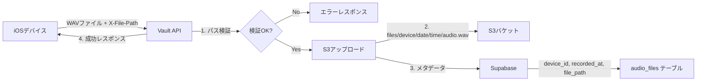

# WatchMe Vault API (S3 Storage)

**iOSデバイスからの録音データをS3に保存するシンプルなアップロードAPI**

WatchMeプロジェクトにおけるファイル管理のエントリーポイントとなるAPIです。iOSデバイスから送信されたWAVファイルをAmazon S3に保存し、後続の処理API（transcriber, behavior, emotion）が処理できるようにSupabaseにメタデータを登録します。

## 🎯 主な責務

このAPIは以下の2つの機能に特化しています：

1. **WAVファイルのS3アップロード** - iOSデバイスから送信された音声ファイルをS3に保存
2. **メタデータのSupabase登録** - 後続APIが処理対象を発見できるようにメタデータを登録

## 📋 API仕様

### エンドポイント一覧

| メソッド | パス | 説明 |
|---------|------|------|
| POST | `/upload` | WAVファイルをS3にアップロード |
| GET | `/health` | APIの死活監視 |
| GET | `/status` | APIの死活監視（/healthのエイリアス） |
| GET | `/` | API情報ページ（HTML） |

### POST /upload

WAVファイルをS3にアップロードし、Supabaseにメタデータを登録します。

**リクエスト:**
- **Headers:**
  - `X-File-Path`: 必須。形式: `device_id/YYYY-MM-DD/raw/HH-MM.wav`
  - `Content-Type`: `multipart/form-data`
- **Form Data:**
  - `device_id`: デバイスID（必須）
  - `file`: WAVファイル（必須、最大100MB）

**レスポンス例（成功時）:**
```json
{
  "status": "ok",
  "s3_key": "files/device123/2025-07-16/14-30/audio.wav",
  "device_id": "device123",
  "recorded_at": "2025-07-16T14:30:00+00:00",
  "file_size_bytes": 2458624,
  "method": "s3_upload"
}
```

**エラーレスポンス例:**
```json
// X-File-Pathヘッダーがない場合
{
  "detail": "X-File-Path header is required for audio file uploads"
}

// パス形式が不正な場合
{
  "detail": "Invalid file path format. Expected: device_id/YYYY-MM-DD/raw/HH-MM.wav"
}

// ファイルサイズ超過
{
  "detail": "File size exceeds limit (100MB)"
}

// S3アップロード失敗
{
  "detail": "S3 upload failed: [エラー詳細]"
}
```

### GET /health, /status

APIの死活監視とS3/Supabase接続状態を確認します。

**レスポンス例:**
```json
{
  "status": "healthy",
  "timestamp": "2025-07-16T10:30:00+00:00",
  "s3_configured": true,
  "supabase_configured": true
}
```

## 🗄️ データ構造

### S3パス構造

#### 入力パス（X-File-Pathヘッダー）
```
device_id/YYYY-MM-DD/raw/HH-MM.wav
```
例: `device123/2025-07-16/raw/14-30.wav`

#### S3保存パス
```
files/{device_id}/{YYYY-MM-DD}/{HH-MM}/audio.wav
```
例: `files/device123/2025-07-16/14-30/audio.wav`

**パス変換ルール:**
- `raw/`ディレクトリを削除
- ファイル名を`audio.wav`に統一
- プレフィックスとして`files/`を追加

### S3ファイルへのアクセス方法

#### S3のURL形式
S3に保存されたファイルのURLは以下の形式になります：
```
https://[バケット名].s3.[リージョン].amazonaws.com/[キー]
```

実際の例：
```
https://watchme-vault.s3.us-east-1.amazonaws.com/files/test_device_001/2025-07-18/14-30/audio.wav
```

#### ⚠️ 重要：ブラウザからの直接アクセスについて

**デフォルトではS3バケットは非公開設定のため、上記URLに直接アクセスしても403 Forbiddenエラーになります。**

音声ファイルにアクセスする方法は3つあります：

### 1. 署名付きURL（Presigned URL）- 推奨方法

一時的にアクセス可能なURLを生成する方法です。セキュリティを保ちながら、ブラウザから直接アクセスできます。

**実装例（Python/boto3）:**
```python
def generate_presigned_url(s3_key, expiration_hours=1):
    """
    S3オブジェクトの署名付きURLを生成
    
    Args:
        s3_key: S3のキー（例: files/device123/2025-07-18/14-30/audio.wav）
        expiration_hours: URLの有効期限（時間）
    
    Returns:
        署名付きURL（ブラウザで直接アクセス可能）
    """
    url = s3_client.generate_presigned_url(
        'get_object',
        Params={
            'Bucket': S3_BUCKET_NAME,
            'Key': s3_key
        },
        ExpiresIn=expiration_hours * 3600  # 秒単位
    )
    return url
```

**生成されるURL例:**
```
https://watchme-vault.s3.amazonaws.com/files/test_device_001/2025-07-18/14-30/audio.wav?AWSAccessKeyId=AKIA...&Signature=jMtT...&Expires=1752804858
```

このURLは指定時間（例：1時間）だけ有効で、ブラウザに貼り付けると音声ファイルを再生・ダウンロードできます。

### 2. AWS SDKを使用した直接取得

バックエンドから直接ファイルを取得する方法：

```python
# ファイルをメモリに読み込む
response = s3_client.get_object(Bucket=S3_BUCKET_NAME, Key=s3_key)
audio_data = response['Body'].read()

# ファイルをローカルに保存
s3_client.download_file(S3_BUCKET_NAME, s3_key, 'local_audio.wav')
```

### 3. S3バケットポリシーで公開（非推奨）

特定のパスのみ公開することも可能ですが、セキュリティリスクがあるため推奨しません。

### 管理画面での実装推奨パターン

管理画面から音声ファイルにアクセスする場合の推奨実装：

```python
# FastAPIエンドポイントの例
@app.get("/api/audio/presigned-url")
async def get_audio_presigned_url(
    device_id: str = Query(...),
    date: str = Query(...),
    time_slot: str = Query(...),
    expiration_hours: int = Query(default=1, le=24)
):
    """
    音声ファイルの署名付きURLを生成
    
    Returns:
        {
            "presigned_url": "https://...",
            "expires_in": "1時間",
            "s3_key": "files/device123/2025-07-18/14-30/audio.wav"
        }
    """
    s3_key = f"files/{device_id}/{date}/{time_slot}/audio.wav"
    
    # ファイルの存在確認
    try:
        s3_client.head_object(Bucket=S3_BUCKET_NAME, Key=s3_key)
    except ClientError:
        raise HTTPException(status_code=404, detail="Audio file not found")
    
    # 署名付きURL生成
    url = s3_client.generate_presigned_url(
        'get_object',
        Params={'Bucket': S3_BUCKET_NAME, 'Key': s3_key},
        ExpiresIn=expiration_hours * 3600
    )
    
    return {
        "presigned_url": url,
        "expires_in": f"{expiration_hours}時間",
        "s3_key": s3_key
    }
```

**フロントエンドでの使用例（React）:**
```javascript
// 署名付きURLを取得
const response = await fetch(`/api/audio/presigned-url?device_id=${deviceId}&date=${date}&time_slot=${timeSlot}`);
const data = await response.json();

// HTML5 Audioで再生
const audio = new Audio(data.presigned_url);
audio.play();

// またはaudioタグで表示
<audio controls src={data.presigned_url} />
```

### Supabaseテーブル構造（audio_files）

**現在の実装で使用しているカラム:**
| カラム名 | 型 | 説明 | 制約 |
|---------|-----|------|------|
| device_id | string | デバイスID | NOT NULL |
| recorded_at | timestamp with timezone | 録音開始時刻 | NOT NULL |
| file_path | string | S3のファイルパス | NOT NULL |

**注意事項:**
- `(device_id, recorded_at)`の組み合わせにユニーク制約があります
- 同じデバイスで同じ時刻のデータは上書きできません

**将来的に追加予定のカラム（現在は未実装）:**
| カラム名 | 型 | 説明 |
|---------|-----|------|
| id | UUID | 主キー |
| file_size_bytes | integer | ファイルサイズ（バイト） |
| duration_seconds | float | 音声の長さ（秒） |
| transcriber_status | string | 文字起こし処理状態 |
| behavior_status | string | 行動分析処理状態 |
| emotion_status | string | 感情分析処理状態 |
| created_at | timestamp | レコード作成日時 |
| updated_at | timestamp | レコード更新日時 |

## 🚀 セットアップ

### 必要な環境変数

`.env`ファイルを作成し、以下の環境変数を設定してください：

```bash
# AWS S3設定
AWS_ACCESS_KEY_ID=your_access_key_id
AWS_SECRET_ACCESS_KEY=your_secret_access_key
S3_BUCKET_NAME=watchme-vault
AWS_REGION=us-east-1

# Supabase設定
SUPABASE_URL=https://your-project.supabase.co
SUPABASE_KEY=your_anon_key
```

### S3バケットの設定

1. AWSコンソールでS3バケットを作成（例: `watchme-vault`）
2. IAMユーザーを作成し、以下のポリシーを付与：

```json
{
  "Version": "2012-10-17",
  "Statement": [
    {
      "Effect": "Allow",
      "Action": [
        "s3:PutObject",
        "s3:GetObject",
        "s3:DeleteObject",
        "s3:ListBucket"
      ],
      "Resource": [
        "arn:aws:s3:::watchme-vault/*",
        "arn:aws:s3:::watchme-vault"
      ]
    }
  ]
}
```

### Supabaseの設定

1. Supabaseプロジェクトでテーブルを作成（存在しない場合）：

```sql
CREATE TABLE IF NOT EXISTS audio_files (
    device_id TEXT NOT NULL,
    recorded_at TIMESTAMPTZ NOT NULL,
    file_path TEXT NOT NULL,
    PRIMARY KEY (device_id, recorded_at)
);

-- インデックスの作成（パフォーマンス向上）
CREATE INDEX IF NOT EXISTS idx_audio_files_device_id ON audio_files(device_id);
CREATE INDEX IF NOT EXISTS idx_audio_files_recorded_at ON audio_files(recorded_at);
```

### インストールと起動

#### 開発環境（ローカル）

```bash
# 依存関係のインストール
pip install -r requirements.txt

# 開発サーバーの起動
uvicorn app:app --reload --host 0.0.0.0 --port 8000
```

#### 本番環境（Docker - 推奨）

**本番環境ではDockerコンテナとして実行することを強く推奨します。**

**必要なもの:**
- Docker
- Docker Compose

**デプロイ手順:**
```bash
# 1. サーバーに接続
ssh -i ~/watchme-key.pem ubuntu@3.24.16.82

# 2. 作業ディレクトリに移動
cd /home/ubuntu/watchme-vault-api-docker

# 3. 最新コードを取得（初回時）
git clone [リポジトリURL] .

# 4. 環境変数を設定（初回時）
cp .env.example .env
nano .env  # 環境変数を設定

# 5. Dockerコンテナをビルド・起動
docker-compose build --no-cache
docker-compose up -d

# 6. ヘルスチェック
curl http://localhost:8000/health
```

**更新手順:**
```bash
# 1. 最新コードを取得
git pull origin main

# 2. コンテナを再ビルド・再起動
docker-compose down
docker-compose build --no-cache
docker-compose up -d
```

**運用コマンド:**
```bash
# ログ確認
docker-compose logs -f vault-api

# ステータス確認
docker-compose ps

# 再起動
docker-compose restart vault-api

# 停止
docker-compose down
```

## 📱 iOSアプリからの使用例

```swift
// Swift実装例
func uploadAudioFile(deviceId: String, date: String, timeSlot: String, audioData: Data) {
    let url = URL(string: "https://api.hey-watch.me/upload")!
    var request = URLRequest(url: url)
    request.httpMethod = "POST"
    
    // 保存パスをヘッダーで指定（必須）
    let filePath = "\(deviceId)/\(date)/raw/\(timeSlot).wav"
    request.setValue(filePath, forHTTPHeaderField: "X-File-Path")
    
    // FormDataでWAVファイルをアップロード
    let boundary = UUID().uuidString
    request.setValue("multipart/form-data; boundary=\(boundary)", forHTTPHeaderField: "Content-Type")
    
    // Multipart Form Dataの構築
    var body = Data()
    
    // device_idフィールド
    body.append("--\(boundary)\r\n".data(using: .utf8)!)
    body.append("Content-Disposition: form-data; name=\"device_id\"\r\n\r\n".data(using: .utf8)!)
    body.append("\(deviceId)\r\n".data(using: .utf8)!)
    
    // fileフィールド
    body.append("--\(boundary)\r\n".data(using: .utf8)!)
    body.append("Content-Disposition: form-data; name=\"file\"; filename=\"\(timeSlot).wav\"\r\n".data(using: .utf8)!)
    body.append("Content-Type: audio/wav\r\n\r\n".data(using: .utf8)!)
    body.append(audioData)
    body.append("\r\n".data(using: .utf8)!)
    
    body.append("--\(boundary)--\r\n".data(using: .utf8)!)
    
    request.httpBody = body
    
    // リクエスト送信
    URLSession.shared.dataTask(with: request) { data, response, error in
        // レスポンス処理
    }.resume()
}

// 使用例
let deviceId = "device123"
let date = "2025-07-18"
let timeSlot = "14-30"  // 14:30-15:00の録音
uploadAudioFile(deviceId: deviceId, date: date, timeSlot: timeSlot, audioData: wavData)
```

## 🔄 処理フロー



## 🔧 開発・デバッグ

### テストスクリプト

プロジェクトには以下のユーティリティスクリプトが含まれています：

- `test_api.py` - APIの動作確認テスト
- `check_supabase.py` - Supabaseテーブル構造の確認
- `verify_upload.py` - S3とSupabaseのデータ確認
- `generate_presigned_url.py` - S3ファイルの署名付きURL生成（ブラウザアクセス用）

```bash
# APIテストの実行
python test_api.py

# Supabaseテーブル確認
python check_supabase.py

# アップロードデータの確認
python verify_upload.py
```

### ログとモニタリング

- APIログはuvicornの標準出力に出力されます
- S3アップロードエラーは詳細なエラーメッセージと共に返されます
- Supabaseエラーもクライアントに返されます（開発環境のみ推奨）

## ⚠️ 重要な変更点（v2.0.0）

### 廃止されたエンドポイント
以下のエンドポイントは責務の明確化のため廃止されました：

- ❌ JSONファイルのアップロード系（`/upload-transcription`, `/upload-prompt`等）
- ❌ ファイルのダウンロード系（`/download`, `/view-file`等）
- ❌ Webダッシュボード用API（`/api/devices/...`）
- ❌ ファイル一覧表示（`/status`のHTML版）

### アーキテクチャの変更
- **旧**: EC2ローカルディスク → Vault API → 各種クライアント
- **新**: S3 + Supabase → 各処理API/管理画面が直接アクセス

### 移行ガイド
- **ファイルの取得**: 各処理APIがS3から直接取得（AWS SDK使用）
- **解析結果の管理**: 各処理APIがSupabaseに直接保存
- **Webダッシュボード**: Supabaseから直接データを取得
- **管理画面**: S3 SDKを使用してファイル一覧を取得（次の開発フェーズ）

## 🚀 今後の拡張予定

### 管理画面向け機能（計画中）
- S3ファイル一覧取得API
- ファイルの削除・移動機能
- バッチアップロード機能
- ストレージ使用量レポート

### 処理ステータス管理（計画中）
- Supabaseテーブルの拡張
- 処理ステータスの更新API
- WebSocket通知機能

## 🛡️ セキュリティ考慮事項

1. **パストラバーサル対策**: X-File-Pathの厳密な検証
2. **ファイルサイズ制限**: 100MBまで
3. **Content-Type検証**: audio/wavのみ受け付け（将来実装）
4. **認証機能**: 現在は未実装（将来的にJWT認証を追加予定）

## トラブルシューティング

### よくあるエラーと対処法

**S3接続エラー**
```
"S3 client not configured. Please set AWS credentials."
```
→ 環境変数が正しく設定されているか確認

**Supabase重複エラー**
```
"duplicate key value violates unique constraint"
```
→ 同じdevice_idとrecorded_atの組み合わせが既に存在

**ファイルサイズエラー**
```
"File size exceeds limit (100MB)"
```
→ ファイルを圧縮するか、分割してアップロード

## 更新履歴

### 2025/7/18 - v2.1.0（Dockerデプロイ対応）
- **Dockerコンテナ化**: systemdからDockerコンテナによる運用に移行
- **Docker Compose構成**: 開発用・本番用の構成ファイルを提供
- **自動デプロイスクリプト**: `deploy.sh`による自動化
- **ドキュメント整備**: `DEPLOYMENT.md`による詳細な運用手順
- **アップロードスクリプト**: `upload_to_server.sh`による簡単デプロイ

### 2025/7/18 - v2.0.0（S3移行版）
- ストレージをEC2ローカルディスクからS3に完全移行
- ファイルパス構造を`files/{device_id}/{date}/{time}/audio.wav`に変更
- Supabaseへのメタデータ登録機能を追加
- 不要なエンドポイントを廃止してAPIをシンプル化
- エラーハンドリングの改善
- テストスクリプトとユーティリティの追加

### 2025/7/9 - v1.4.0
- X-File-Pathヘッダーを必須化
- ファイルパス形式にrawディレクトリ追加

## 開発者情報

- 作成者: Kaya Matsumoto
- 最終更新: 2025年7月18日
- バージョン: 2.1.0（Dockerデプロイ対応）
- リポジトリ: [プライベートリポジトリ]

## ライセンス

本プロジェクトは非公開プロジェクトです。無断での使用・複製・配布を禁じます。